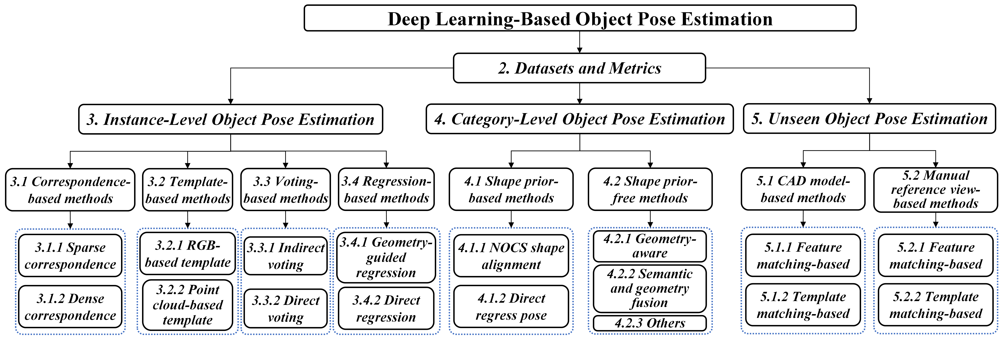
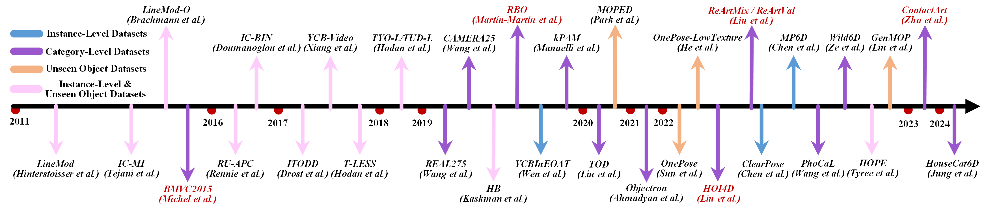

# Deep Learning-Based Object Pose Estimation: A Comprehensive Survey

[Jian Liu](https://cnjliu.github.io/), Wei Sun, Hui Yang, Zhiwen Zeng, Chongpei Liu,

Jin Zeng, [Xingyu Liu](https://lliu-xingyu.github.io/), [Hossein Rahmani](https://sites.google.com/view/rahmaniatlu), [Nicu Sebe](https://scholar.google.com.hk/citations?user=stFCYOAAAAAJ&hl=zh-CN&oi=ao), [Ajmal Mian](https://ajmalsaeed.net/)

### [Introduction](#introduction) | [Datasets](#datasets) | [Instance-Level Methods](#instance-level) | [Category-Level Methods](#category-level) | [Unseen Methods](#unseen) | [Applications](#applications)

## Introduction

This is the official repository of [''Deep Learning-Based Object Pose Estimation: A Comprehensive Survey''](https://arxiv.org/pdf/2202.02980.pdf). Specifically, we first introduce the [[datasets]](#datasets) used for object pose estimation. Then, we review the [[instance-level]](#instance-level), [[category-level]](#category-level), and [[unseen]](#unseen) methods, respectively. Finally, we summarize the common [[applications]](#applications) of this task. The taxonomy of this survey is shown as follows

  

## Datasets
Chronological overview of the datasets for object pose estimation evaluation. Notably, the pink arrows represent the BOP datasets, which can be used to evaluate both instance-level and unseen object methods. The red references represent the datasets of articulated objects. From this, we can also see the development trend in the field of object pose estimation, i.e., from instance-level methods to category-level and unseen methods.

  

#### Resources of the Datasets

- KITTI-3D [[Paper (CVPR'12)]](http://www.cvlibs.net/publications/Geiger2012CVPR.pdf) [[Paper (IJRR'13)]](https://www.mrt.kit.edu/z/publ/download/2013/GeigerAl2013IJRR.pdf) [[Homepage]](http://www.cvlibs.net/datasets/kitti/) [[Data]](http://www.cvlibs.net/datasets/kitti/eval_object.php?obj_benchmark=3d) [[Benchmark]](http://www.cvlibs.net/datasets/kitti/eval_object.php?obj_benchmark=3d)
- Argoverse [[Paper (CVPR'19)]](https://openaccess.thecvf.com/content_CVPR_2019/papers/Chang_Argoverse_3D_Tracking_and_Forecasting_With_Rich_Maps_CVPR_2019_paper.pdf) [[Paper (NeurIPS'21)]](https://datasets-benchmarks-proceedings.neurips.cc/paper/2021/file/4734ba6f3de83d861c3176a6273cac6d-Paper-round2.pdf) [[Homepage]](https://www.argoverse.org/index.html) [[Data]](https://www.argoverse.org/data.html#download-link) [[Benchmark]](https://eval.ai/web/challenges/challenge-page/725/leaderboard/1974)
- Lyft L5 [[Homepage]](https://level-5.global/) [[Data]](https://level-5.global/download/) 
- H3D [[Paper (ICRA'19)]](https://arxiv.org/pdf/1903.01568.pdf) [[Data]](https://usa.honda-ri.com//H3D)
- A\*3D [[Paper (ICRA'20)]](https://arxiv.org/pdf/1909.07541.pdf) [[Homepage]](https://github.com/I2RDL2/ASTAR-3D)
- nuScenes [[Paper (CVPR'20)]](https://arxiv.org/abs/1903.11027.pdf) [[Homepage]](https://www.nuscenes.org/) [[Data]](https://www.nuscenes.org/nuscenes#download) [[Benchmark]](https://www.nuscenes.org/object-detection?externalData=all&mapData=all&modalities=Camera)
- Waymo Open [[Paper (CVPR'20)]](https://arxiv.org/abs/1912.04838.pdf) [[Homepage]](https://waymo.com/open/) [[Data]](https://waymo.com/open/download/) [[Benchmark]](https://waymo.com/open/challenges/2020/3d-detection/)
- CityScapes-3D [[Paper (CVPR'20 Workshop)]](https://arxiv.org/pdf/2006.07864.pdf) [[Homepage]](https://www.cityscapes-dataset.com/) [[Data]](https://www.cityscapes-dataset.com/downloads/) [[Benchmark]](https://www.cityscapes-dataset.com/benchmarks/#3d-vehicle-detection-task)
- A2D2 [[Paper (arXiv)]](https://arxiv.org/pdf/2004.06320.pdf) [[Homepage]](https://www.a2d2.audi/a2d2/en.html) [[Data]](https://www.a2d2.audi/a2d2/en/download.html)
- KITTI-360 [[Paper (arXiv)]](https://arxiv.org/abs/2109.13410.pdf) [[Homepage]](http://www.cvlibs.net/datasets/kitti-360/) [[Data]](http://www.cvlibs.net/datasets/kitti-360/download.php) [[Benchmark]](http://www.cvlibs.net/datasets/kitti-360/leaderboard_scene_understanding.php?task=box3d)
- Rope3D [[Paper (CVPR'22)]](https://openaccess.thecvf.com/content/CVPR2022/papers/Ye_Rope3D_The_Roadside_Perception_Dataset_for_Autonomous_Driving_and_Monocular_CVPR_2022_paper.pdf) [[Homepage]](https://thudair.baai.ac.cn/index) [[Data]](https://thudair.baai.ac.cn/rope)

## Instance-Level

## Category-Level

## Unseen

## Applications
