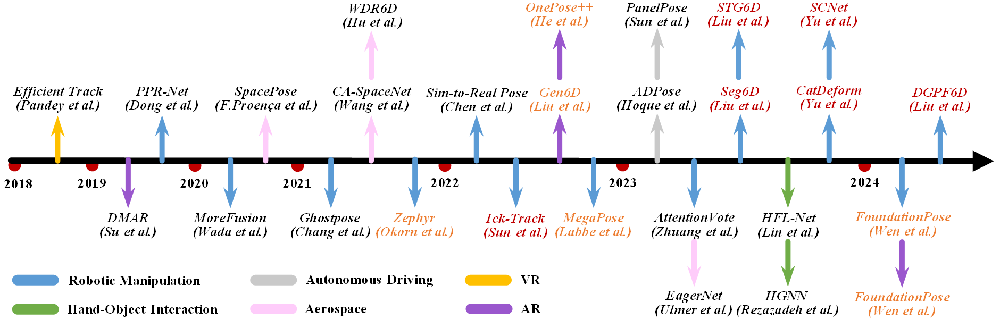

# Deep Learning-Based Object Pose Estimation: A Comprehensive Survey

[Jian Liu](https://cnjliu.github.io/), Wei Sun, Hui Yang, Zhiwen Zeng, Chongpei Liu,

Jin Zeng, [Xingyu Liu](https://lliu-xingyu.github.io/), [Hossein Rahmani](https://sites.google.com/view/rahmaniatlu), [Nicu Sebe](https://scholar.google.com.hk/citations?user=stFCYOAAAAAJ&hl=zh-CN&oi=ao), [Ajmal Mian](https://ajmalsaeed.net/)

### [Introduction](#introduction) | [Datasets](#datasets) | [Instance-Level](#instance-level) | [Category-Level](#category-level) | [Unseen](#unseen) | [Applications](#applications)

## Introduction

This is the official repository of [''Deep Learning-Based Object Pose Estimation: A Comprehensive Survey''](https://arxiv.org/pdf/2202.02980.pdf). Specifically, we first introduce the [datasets](#datasets) used for object pose estimation. Then, we review the [instance-level](#instance-level), [category-level](#category-level), and [unseen](#unseen) methods, respectively. Finally, we summarize the common [applications](#applications) of this task. The taxonomy of this survey is shown as follows

  

## Datasets
Chronological overview of the datasets for object pose estimation evaluation. Notably, the pink arrows represent the BOP Challenge datasets, which can be used to evaluate both instance-level and unseen object methods. The red references represent the datasets of articulated objects.

  

### Datasets for Instance-Level Methods

All Datasets

  
- BOP Challenge Datasets [[Paper]](https://arxiv.org/abs/2403.09799) [[Data]](https://bop.felk.cvut.cz/challenges/bop-challenge-2023/)
- YCBInEOAT Dataset [[Paper]](https://ieeexplore.ieee.org/stamp/stamp.jsp?tp=&arnumber=9341314) [[Data]](https://github.com/wenbowen123/iros20-6d-pose-tracking)

### Datasets for Category-Level Methods

Rigid Objects Datasets

  
- CAMERA25 Dataset [[Paper]](https://openaccess.thecvf.com/content_CVPR_2019/papers/Wang_Normalized_Object_Coordinate_Space_for_Category-Level_6D_Object_Pose_and_CVPR_2019_paper.pdf) [[Data]](https://github.com/hughw19/NOCS_CVPR2019)
- REAL275 Dataset [[Paper]](https://openaccess.thecvf.com/content_CVPR_2019/papers/Wang_Normalized_Object_Coordinate_Space_for_Category-Level_6D_Object_Pose_and_CVPR_2019_paper.pdf) [[Data]](https://github.com/hughw19/NOCS_CVPR2019)
- kPAM Dataset [[Paper]](https://link.springer.com/chapter/10.1007/978-3-030-95459-8_9) [[Data]](https://sites.google.com/view/kpam)
- TOD Dataset [[Paper]](https://openaccess.thecvf.com/content_CVPR_2020/papers/Liu_KeyPose_Multi-View_3D_Labeling_and_Keypoint_Estimation_for_Transparent_Objects_CVPR_2020_paper.pdf) [[Data]](https://sites.google.com/view/keypose)
- Objectron Dataset [[Paper]](https://openaccess.thecvf.com/content/CVPR2021/papers/Ahmadyan_Objectron_A_Large_Scale_Dataset_of_Object-Centric_Videos_in_the_CVPR_2021_paper.pdf) [[Data]](https://github.com/google-research-datasets/Objectron)
- Wild6D Dataset [[Paper]](https://proceedings.neurips.cc/paper_files/paper/2022/hash/afe99e55be23b3523818da1fefa33494-Abstract-Conference.html) [[Data]](https://oasisyang.github.io/semi-pose/)
- PhoCaL Dataset [[Paper]](https://openaccess.thecvf.com/content/CVPR2022/papers/Wang_PhoCaL_A_Multi-Modal_Dataset_for_Category-Level_Object_Pose_Estimation_With_CVPR_2022_paper.pdf) [[Data]](https://www.campar.in.tum.de/public_datasets/2022_cvpr_wang/)
- HouseCat6D Dataset [[Paper]](https://arxiv.org/pdf/2212.10428) [[Data]](https://sites.google.com/view/housecat6d)

Articulated Objects Datasets

  
- BMVC Dataset [[Paper]](https://www.researchgate.net/profile/Frank-Michel/publication/292033202_Pose_Estimation_of_Kinematic_Chain_Instances_via_Object_Coordinate_Regression/links/56caf40b08aee3cee5414a70/Pose-Estimation-of-Kinematic-Chain-Instances-via-Object-Coordinate-Regression.pdf) [[Data]](https://gaminghardware-guide.de/gaminghardware-guide-de-hat-cvlab-dresden-de-uebernommen/research/scene-understanding/pose-estimation/#BMVC15)
- RBO Dataset [[Paper]](https://journals.sagepub.com/doi/full/10.1177/0278364919844314) [[Data]](https://zenodo.org/records/1036660)
- HOI4D Dataset [[Paper]](https://openaccess.thecvf.com/content/CVPR2022/papers/Liu_HOI4D_A_4D_Egocentric_Dataset_for_Category-Level_Human-Object_Interaction_CVPR_2022_paper.pdf) [[Data]](http://www.hoi4d.top/)
- ReArtMix/ReArtVal Dataset [[Paper]](https://ieeexplore.ieee.org/abstract/document/9670684)
- ContactArt Dataset [[Paper]](https://arxiv.org/pdf/2305.01618) [[Data]](https://zehaozhu.github.io/ContactArt/)

### Datasets for Unseen Methods

All Datasets

- BOP Challenge Datasets [[Paper]](https://arxiv.org/abs/2403.09799) [[Data]](https://bop.felk.cvut.cz/challenges/bop-challenge-2023/)
- MOPED Dataset [[Paper]](https://openaccess.thecvf.com/content_CVPR_2020/papers/Park_LatentFusion_End-to-End_Differentiable_Reconstruction_and_Rendering_for_Unseen_Object_Pose_CVPR_2020_paper.pdf) [[Data]](https://latentfusion.github.io/)
- GenMOP Dataset [[Paper]](https://link.springer.com/content/pdf/10.1007/978-3-031-19824-3_18) [[Data]](https://liuyuan-pal.github.io/Gen6D/)
- OnePose Dataset [[Paper]](https://openaccess.thecvf.com/content/CVPR2022/papers/Sun_OnePose_One-Shot_Object_Pose_Estimation_Without_CAD_Models_CVPR_2022_paper.pdf) [[Data]](https://zju3dv.github.io/onepose/)
- OnePose-LowTexture Dataset [[Paper]](https://papers.nips.cc/paper_files/paper/2022/file/e43f900f571de6c96a70d5724a0fb565-Paper-Conference.pdf) [[Data]](https://zju3dv.github.io/onepose_plus_plus/)

## Instance-Level
Instance-level object pose estimation describes the task of estimating the pose of the objects that have been seen during the training of the model. We classify existing instance-level methods into four categories: correspondence-based, template-based, voting-based, and regression-based methods.
### Correspondence-Based Methods

Sparse Correspondence Methods

#### 2017
- BB8: A Scalable, Accurate, Robust to Partial Occlusion Method for Predicting the 3D Poses of Challenging Objects Without Using Depth
 [[Paper]](https://openaccess.thecvf.com/content_ICCV_2017/papers/Rad_BB8_A_Scalable_ICCV_2017_paper.pdf)
- 6-dof object pose from semantic keypoints [[Paper]](https://ieeexplore.ieee.org/abstract/document/7989233) [[Code]](https://github.com/geopavlakos/object3d)
- Robust 3D Object Tracking from Monocular Images Using Stable Parts [[Paper]](https://ieeexplore.ieee.org/abstract/document/7934426)
#### 2018
- Real-Time Seamless Single Shot 6D Object Pose Prediction [[Paper]](https://openaccess.thecvf.com/content_cvpr_2018/papers/Tekin_Real-Time_Seamless_Single_CVPR_2018_paper.pdf)
- Making Deep Heatmaps Robust to Partial Occlusions for 3D Object Pose Estimation [[Paper]](https://openaccess.thecvf.com/content_ECCV_2018/papers/Markus_Oberweger_Making_Deep_Heatmaps_ECCV_2018_paper.pdf)
#### 2019
- Segmentation-Driven 6D Object Pose Estimation [[Paper]](https://openaccess.thecvf.com/content_CVPR_2019/papers/Hu_Segmentation-Driven_6D_Object_Pose_Estimation_CVPR_2019_paper.pdf)
- Learning Local RGB-to-CAD Correspondences for Object Pose Estimation [[Paper]](https://openaccess.thecvf.com/content_ICCV_2019/papers/Georgakis_Learning_Local_RGB-to-CAD_Correspondences_for_Object_Pose_Estimation_ICCV_2019_paper.pdf)
#### 2020
- HOPE-Net: A Graph-Based Model for Hand-Object Pose Estimation [[Paper]](https://openaccess.thecvf.com/content_CVPR_2020/papers/Doosti_HOPE-Net_A_Graph-Based_Model_for_Hand-Object_Pose_Estimation_CVPR_2020_paper.pdf)
- HybridPose: 6D Object Pose Estimation Under Hybrid Representations [[Paper]](https://openaccess.thecvf.com/content_CVPR_2020/papers/Song_HybridPose_6D_Object_Pose_Estimation_Under_Hybrid_Representations_CVPR_2020_paper.pdf)
- Learning Deep Network for Detecting 3D Object Keypoints and 6D Poses [[Paper]](https://openaccess.thecvf.com/content_CVPR_2020/papers/Zhao_Learning_Deep_Network_for_Detecting_3D_Object_Keypoints_and_6D_CVPR_2020_paper.pdf)
- Introducing Pose Consistency and Warp-Alignment for Self-Supervised 6D Object Pose Estimation in Color Images [[Paper]](https://ieeexplore.ieee.org/abstract/document/9320376)
#### 2021
- MFPN-6D : Real-time One-stage Pose Estimation of Objects on RGB Images [[Paper]](https://ieeexplore.ieee.org/abstract/document/9561878)
- Wide-Depth-Range 6D Object Pose Estimation in Space [[Paper]](https://openaccess.thecvf.com/content/CVPR2021/papers/Hu_Wide-Depth-Range_6D_Object_Pose_Estimation_in_Space_CVPR_2021_paper.pdf)
- Confidence-Based 6D Object Pose Estimation [[Paper]](https://ieeexplore.ieee.org/abstract/document/9464273)
- DSC-PoseNet: Learning 6DoF Object Pose Estimation via Dual-Scale Consistency [[Paper]](https://openaccess.thecvf.com/content/CVPR2021/papers/Yang_DSC-PoseNet_Learning_6DoF_Object_Pose_Estimation_via_Dual-Scale_Consistency_CVPR_2021_paper.pdf)
- Semi-Supervised 3D Hand-Object Poses Estimation With Interactions in Time [[Paper]](https://openaccess.thecvf.com/content/CVPR2021/papers/Liu_Semi-Supervised_3D_Hand-Object_Poses_Estimation_With_Interactions_in_Time_CVPR_2021_paper.pdf) [[Code]](https://stevenlsw.github.io/Semi-Hand-Object)
- Keypoint-Graph-Driven Learning Framework for Object Pose Estimation [[Paper]](https://openaccess.thecvf.com/content/CVPR2021/papers/Zhang_Keypoint-Graph-Driven_Learning_Framework_for_Object_Pose_Estimation_CVPR_2021_paper.pdf)
- PyraPose: Feature Pyramids for Fast and Accurate Object Pose Estimation under Domain Shift [[Paper]](https://ieeexplore.ieee.org/abstract/document/9562108)
#### 2023
- Knowledge Distillation for 6D Pose Estimation by Aligning Distributions of Local Predictions [[Paper]](https://openaccess.thecvf.com/content/CVPR2023/papers/Guo_Knowledge_Distillation_for_6D_Pose_Estimation_by_Aligning_Distributions_of_CVPR_2023_paper.pdf)
- Linear-Covariance Loss for End-to-End Learning of 6D Pose Estimation [[Paper]](https://openaccess.thecvf.com/content/ICCV2023/papers/Liu_Linear-Covariance_Loss_for_End-to-End_Learning_of_6D_Pose_Estimation_ICCV_2023_paper.pdf)

Dense Correspondence Methods

  
#### 2019

#### 2020

### Template-Based Methods

RGB-Based Template Methods

  
#### 2018
-  Implicit 3D Orientation Learning for 6D Object Detection from RGB Images [[Paper]](https://openaccess.thecvf.com/content_ECCV_2018/papers/Martin_Sundermeyer_Implicit_3D_Orientation_ECCV_2018_paper.pdf) [[Code]](https://github.com/DLR-RM/AugmentedAutoencoder)
#### 2019
- 6DoF Pose Estimation with Object Cutout based on a Deep Autoencoder [[Paper]](https://ieeexplore.ieee.org/abstract/document/8951932)
#### 2020
- 6D Object Pose Estimation Algorithm Using Preprocessing of Segmentation and Keypoint Extraction [[Paper]](https://ieeexplore.ieee.org/abstract/document/9128980)
- Domain-Translated 3D Object Pose Estimation [[Paper]](https://ieeexplore.ieee.org/abstract/document/9206072)
- Pose-guided Auto-Encoder and Feature-Based Refinement for 6-DoF Object Pose Regression [[Paper]](https://ieeexplore.ieee.org/abstract/document/9196953)
- Spatial Attention Improves Iterative 6D Object Pose Estimation [[Paper]](https://ieeexplore.ieee.org/abstract/document/9320380) [[Code]](https://github.com/stevsics/attention_6d_pose)
#### 2021
- PoseRBPF: A Rao–Blackwellized Particle Filter for 6-D Object Pose Tracking [[Paper]](https://ieeexplore.ieee.org/abstract/document/9363455) [[Code]](https://github.com/NVlabs/PoseRBPF)

Point Cloud-Based Template Methods

  
#### 2022
- DCL-Net: Deep Correspondence Learning Network for 6D Pose Estimation [[Paper]](https://link.springer.com/chapter/10.1007/978-3-031-20077-9_22) [[Code]](https://github.com/Gorilla-Lab-SCUT/DCL-Net)
#### 2023
- SE(3) Diffusion Model-based Point Cloud Registration for Robust 6D Object Pose Estimation [[Paper]](https://proceedings.neurips.cc/paper_files/paper/2023/file/43069caa6776eac8bca4bfd74d4a476d-Paper-Conference.pdf) [[Code]](https://github.com/Jiang-HB/DiffusionReg)
#### 2024
- Match Normalization: Learning-Based Point Cloud Registration for 6D Object Pose Estimation in the Real World [[Paper]](https://ieeexplore.ieee.org/abstract/document/10402084) 

### Voting-Based Methods

Indirect Voting Methods

  
#### 2019
- PVNet: Pixel-Wise Voting Network for 6DoF Pose Estimation [[Paper]](https://openaccess.thecvf.com/content_CVPR_2019/papers/Peng_PVNet_Pixel-Wise_Voting_Network_for_6DoF_Pose_Estimation_CVPR_2019_paper.pdf) [[Code]](https://github.com/zju3dv/pvnet)
#### 2020
- PVN3D: A Deep Point-Wise 3D Keypoints Voting Network for 6DoF Pose Estimation [[Paper]](https://openaccess.thecvf.com/content_CVPR_2020/papers/He_PVN3D_A_Deep_Point-Wise_3D_Keypoints_Voting_Network_for_6DoF_CVPR_2020_paper.pdf) [[Code]](https://github.com/ethnhe/PVN3D.git)
- 6DoF Object Pose Estimation via Differentiable Proxy Voting Loss [[Paper]](https://arxiv.org/abs/2002.03923)
#### 2021
- KDFNet: Learning Keypoint Distance Field for 6D Object Pose Estimation [[Paper]](https://ieeexplore.ieee.org/abstract/document/9636489)
- FFB6D: A Full Flow Bidirectional Fusion Network for 6D Pose Estimation [[Paper]](https://openaccess.thecvf.com/content/CVPR2021/papers/He_FFB6D_A_Full_Flow_Bidirectional_Fusion_Network_for_6D_Pose_CVPR_2021_paper.pdf) [[Code]](https://github.com/ethnhe/FFB6D.git)
- ParametricNet: 6DoF Pose Estimation Network for Parametric Shapes in Stacked Scenarios [[Paper]](https://ieeexplore.ieee.org/abstract/document/9561181) [[Code]](https://github.com/lvwj19/ParametricNet)
#### 2022
- DGECN: A Depth-Guided Edge Convolutional Network for End-to-End 6D Pose Estimation [[Paper]]([https://ieeexplore.ieee.org/abstract/document/9636489](https://openaccess.thecvf.com/content/CVPR2022/papers/Cao_DGECN_A_Depth-Guided_Edge_Convolutional_Network_for_End-to-End_6D_Pose_CVPR_2022_paper.pdf))
- Spatial feature mapping for 6DoF object pose estimation [[Paper]](https://www.sciencedirect.com/science/article/abs/pii/S0031320322003168)
- Vote from the Center: 6 DoF Pose Estimation in RGB-D Images by Radial Keypoint Voting [[Paper]](https://link.springer.com/chapter/10.1007/978-3-031-20080-9_20) [[Code]](https://github.com/aaronWool/rcvpose)
- MV6D: Multi-View 6D Pose Estimation on RGB-D Frames Using a Deep Point-wise Voting Network [[Paper]](https://ieeexplore.ieee.org/abstract/document/9982268)
- Learning to Estimate Object Poses without Real Image Annotations [[Paper]](https://www.ijcai.org/proceedings/2022/0162.pdf)  [[Code]](https://github.com/zju3dv/pvnet-depth-sup)
- Sim2Real Instance-Level Style Transfer for 6D Pose Estimation [[Paper]](https://ieeexplore.ieee.org/abstract/document/9981878)
#### 2023
- BDR6D: Bidirectional Deep Residual Fusion Network for 6D Pose Estimation [[Paper]](https://ieeexplore.ieee.org/abstract/document/10057042)
- KVNet: An iterative 3D keypoints voting network for real-time 6-DoF object pose estimation [[Paper]](https://www.sciencedirect.com/science/article/abs/pii/S092523122300036X)
- Deep Fusion Transformer Network with Weighted Vector-Wise Keypoints Voting for Robust 6D Object Pose Estimation [[Paper]](https://openaccess.thecvf.com/content/ICCV2023/papers/Zhou_Deep_Fusion_Transformer_Network_with_Weighted_Vector-Wise_Keypoints_Voting_for_ICCV_2023_paper.pdf) [[Code]](https://github.com/junzastar/DFTr_Voting)
#### 2024
- 6D-Diff: A Keypoint Diffusion Framework for 6D Object Pose Estimation [[Paper]](https://arxiv.org/abs/2401.00029)

Direct Voting Methods

  
#### 2019
- DenseFusion: 6D Object Pose Estimation by Iterative Dense Fusion [[Paper]](https://openaccess.thecvf.com/content_CVPR_2019/papers/Wang_DenseFusion_6D_Object_Pose_Estimation_by_Iterative_Dense_Fusion_CVPR_2019_paper.pdf) [[Code]](https://github.com/j96w/DenseFusion)
#### 2020
- A Novel Depth and Color Feature Fusion Framework for 6D Object Pose Estimation [[Paper]](https://ieeexplore.ieee.org/abstract/document/9115222)
- PPR-Net++: Accurate 6-D Pose Estimation in Stacked Scenarios [[Paper]](https://ieeexplore.ieee.org/abstract/document/9537584) [[Code]](https://github.com/lvwj19/PPR-Net-plus)
#### 2021
- Robust 6D Object Pose Estimation by Learning RGB-D Features [[Paper]](https://ieeexplore.ieee.org/abstract/document/9197555) [[Code]](https://github.com/mentian/object-posenet)
- PR-GCN: A Deep Graph Convolutional Network With Point Refinement for 6D Pose Estimation [[Paper]](https://openaccess.thecvf.com/content/ICCV2021/papers/Zhou_PR-GCN_A_Deep_Graph_Convolutional_Network_With_Point_Refinement_for_ICCV_2021_paper.pdf) [[Code]](https://github.com/sj-li/PR-GCN)
- TemporalFusion: Temporal Motion Reasoning with Multi-Frame Fusion for 6D Object Pose Estimation [[Paper]](https://ieeexplore.ieee.org/abstract/document/9636583) [[Code]](https://github.com/mufengjun260/TemporalFusion21)
#### 2022
- ES6D: A Computation Efficient and Symmetry-Aware 6D Pose Regression Framework [[Paper]](https://openaccess.thecvf.com/content/CVPR2022/papers/Mo_ES6D_A_Computation_Efficient_and_Symmetry-Aware_6D_Pose_Regression_Framework_CVPR_2022_paper.pdf) [[Code]](https://github.com/GANWANSHUI/ES6D)
- SC6D: Symmetry-agnostic and Correspondence-free 6D Object Pose Estimation [[Paper]](https://ieeexplore.ieee.org/abstract/document/10044457) [[Code]](https://github.com/dingdingcai/SC6D-pose)
#### 2023
- A Depth Adaptive Feature Extraction and Dense Prediction Network for 6-D Pose Estimation in Robotic Grasping [[Paper]](https://ieeexplore.ieee.org/abstract/document/10197263)

### Regression-Based Methods

Geometry-Guided Regression Methods

#### 2020
- 6D Object Pose Regression via Supervised Learning on Point Clouds [[Paper]](https://ieeexplore.ieee.org/abstract/document/9197461)
- Neural Object Learning for 6D Pose Estimation Using a Few Cluttered Images [[Paper]](https://link.springer.com/chapter/10.1007/978-3-030-58548-8_38) [[Code]](https://github.com/kirumang/NOL)
- G2L-Net: Global to Local Network for Real-Time 6D Pose Estimation With Embedding Vector Features [[Paper]](https://openaccess.thecvf.com/content_CVPR_2020/papers/Chen_G2L-Net_Global_to_Local_Network_for_Real-Time_6D_Pose_Estimation_CVPR_2020_paper.pdf) [[Code]](https://github.com/DC1991/G2L_Net)
- Single-Stage 6D Object Pose Estimation [[Paper]](https://openaccess.thecvf.com/content_CVPR_2020/papers/Hu_Single-Stage_6D_Object_Pose_Estimation_CVPR_2020_paper.pdf) 
#### 2021
- 6D Object Pose Estimation with Pairwise Compatible Geometric Features [[Paper]](https://ieeexplore.ieee.org/abstract/document/9561404)
- CloudAAE: Learning 6D Object Pose Regression with On-line Data Synthesis on Point Clouds [[Paper]](https://ieeexplore.ieee.org/abstract/document/9561475) [[Code]](https://github.com/GeeeG/CloudAAE)
- Semi-Supervised 6D Object Pose Estimation Without Using Real Annotations [[Paper]](https://ieeexplore.ieee.org/abstract/document/9662384)
- StablePose: Learning 6D Object Poses From Geometrically Stable Patches [[Paper]](https://openaccess.thecvf.com/content/CVPR2021/papers/Shi_StablePose_Learning_6D_Object_Poses_From_Geometrically_Stable_Patches_CVPR_2021_paper.pdf) [[Code]](https://github.com/GodZarathustra/stablepose_pytorch)
- GCCN: Geometric Constraint Co-attention Network for 6D Object Pose Estimation [[Paper]](https://dl.acm.org/doi/abs/10.1145/3474085.3475209?casa_token=p4ZvjzCKVPcAAAAA:OOKExJlTMyCiS2-5-p1VB7EQIZajbgGxuwvdjrIerKWDS_Ak2s_tSGkaFCzKnLSeTXNnCh9I6yF2CQ)
- SO-Pose: Exploiting Self-Occlusion for Direct 6D Pose Estimation [[Paper]](https://openaccess.thecvf.com/content/ICCV2021/papers/Di_SO-Pose_Exploiting_Self-Occlusion_for_Direct_6D_Pose_Estimation_ICCV_2021_paper.pdf) [[Code]](https://github.com/shangbuhuan13/SO-Pose)
- GDR-Net: Geometry-Guided Direct Regression Network for Monocular 6D Object Pose Estimation [[Paper]](https://openaccess.thecvf.com/content/CVPR2021/papers/Wang_GDR-Net_Geometry-Guided_Direct_Regression_Network_for_Monocular_6D_Object_Pose_CVPR_2021_paper.pdf) [[Code]](https://github.com/THU-DA-6D-Pose-Group/GDR-Net)
- Occlusion-Aware Self-Supervised Monocular 6D Object Pose Estimation [[Paper]](https://ieeexplore.ieee.org/abstract/document/9655492) [[Code]](https://github.com/THU-DA-6D-Pose-Group/self6dpp)

#### 2022
- Trans6D: Transformer-Based 6D Object Pose Estimation and Refinement [[Paper]](https://link.springer.com/chapter/10.1007/978-3-031-25085-9_7)
#### 2023
- SMOC-Net: Leveraging Camera Pose for Self-Supervised Monocular Object Pose Estimation [[Paper]](https://openaccess.thecvf.com/content/CVPR2023/papers/Tan_SMOC-Net_Leveraging_Camera_Pose_for_Self-Supervised_Monocular_Object_Pose_Estimation_CVPR_2023_paper.pdf)
- TexPose: Neural Texture Learning for Self-Supervised 6D Object Pose Estimation [[Paper]](https://openaccess.thecvf.com/content/CVPR2023/papers/Chen_TexPose_Neural_Texture_Learning_for_Self-Supervised_6D_Object_Pose_Estimation_CVPR_2023_paper.pdf) [[Code]](https://github.com/HanzhiC/TexPose)
- NVR-Net: Normal Vector Guided Regression Network for Disentangled 6D Pose Estimation [[Paper]](https://ieeexplore.ieee.org/abstract/document/10168178) 
#### 2024
- PA-Pose: Partial point cloud fusion based on reliable alignment for 6D pose tracking [[Paper]](https://www.sciencedirect.com/science/article/abs/pii/S0031320323008488)
- HFT6D: Multimodal 6D object pose estimation based on hierarchical feature transformer [[Paper]](https://www.sciencedirect.com/science/article/abs/pii/S0263224123014124) 

Direct Regression Methods

  
#### 2017
- Deep 6-DOF Tracking [[Paper]](https://ieeexplore.ieee.org/abstract/document/8007334) [[Code]](https://github.com/lvsn/deeptracking)
- PoseCNN: A Convolutional Neural Network for 6D Object Pose Estimation in Cluttered Scenes [[Paper]](https://arxiv.org/abs/1711.00199) [[Code]](https://github.com/yuxng/PoseCNN)
#### 2018
- Learning 6DoF Object Poses from Synthetic Single Channel Images [[Paper]](https://ieeexplore.ieee.org/abstract/document/8699254)
- Real-Time Object Pose Estimation with Pose Interpreter Networks [[Paper]](https://ieeexplore.ieee.org/abstract/document/8593662) [[Code]](https://github.com/jimmyyhwu/pose-interpreter-networks)
- Deep-6DPose: Recovering 6D Object Pose from a Single RGB Image [[Paper]](https://arxiv.org/abs/1802.10367) [[Code]](https://github.com/ryohachiuma/Deep-6dPose)
- A Unified Framework for Multi-View Multi-Class Object Pose Estimation [[Paper]](https://openaccess.thecvf.com/content_ECCV_2018/papers/Chi_Li_A_Unified_Framework_ECCV_2018_paper.pdf)
- DeepIM: Deep Iterative Matching for 6D Pose Estimation [[Paper]](https://openaccess.thecvf.com/content_ECCV_2018/papers/Yi_Li_DeepIM_Deep_Iterative_ECCV_2018_paper.pdf) [[Code]](https://github.com/liyi14/mx-DeepIM)
- Deep Model-Based 6D Pose Refinement in RGB [[Paper]](https://openaccess.thecvf.com/content_ECCV_2018/papers/Fabian_Manhardt_Deep_Model-Based_6D_ECCV_2018_paper.pdf) [[Code]](https://github.com/fabi92/eccv18-rgb_pose_refinement)
- Object Detection and Pose Estimation Based on Convolutional Neural Networks Trained with Synthetic Data [[Paper]](https://ieeexplore.ieee.org/abstract/document/8594379)
#### 2019
- PCRNet: Point Cloud Registration Network using PointNet Encoding [[Paper]](https://arxiv.org/abs/1908.07906) [[Code]](https://github.com/vinits5/pcrnet)
- Explaining the Ambiguity of Object Detection and 6D Pose From Visual Data [[Paper]](https://openaccess.thecvf.com/content_ICCV_2019/papers/Manhardt_Explaining_the_Ambiguity_of_Object_Detection_and_6D_Pose_From_ICCV_2019_paper.pdf)
- 3D Object Pose Estimation Using Multi-Objective Quaternion Learning [[Paper]](https://ieeexplore.ieee.org/abstract/document/8765585)
- Regression-Based Three-Dimensional Pose Estimation for Texture-Less Objects [[Paper]](https://ieeexplore.ieee.org/abstract/document/8698890) [[Code]](https://github.com/NUAA-Yuanpeng/PoseRegression)
#### 2020
- Single Shot 6D Object Pose Estimation [[Paper]](https://ieeexplore.ieee.org/abstract/document/9197207)
- EfficientPose: An efficient, accurate and scalable end-to-end 6D multi object pose estimation approach [[Paper]](https://arxiv.org/abs/2011.04307) [[Code]](https://github.com/ybkscht/EfficientPose)
- Self6D: Self-supervised Monocular 6D Object Pose Estimation [[Paper]](https://link.springer.com/chapter/10.1007/978-3-030-58452-8_7) [[Code]](https://github.com/THU-DA-6D-Pose-Group/self6dpp)
- CosyPose: Consistent Multi-view Multi-object 6D Pose Estimation [[Paper]](https://link.springer.com/chapter/10.1007/978-3-030-58520-4_34) [[Code]](https://github.com/ylabbe/cosypose)
- se(3)-TrackNet: Data-driven 6D Pose Tracking by Calibrating Image Residuals in Synthetic Domains [[Paper]](https://ieeexplore.ieee.org/abstract/document/9341314) [[Code]](https://github.com/wenbowen123/iros20-6d-pose-tracking)
#### 2021
- Pose Estimation from RGB Images of Highly Symmetric Objects using a Novel Multi-Pose Loss and Differential Rendering [[Paper]](https://ieeexplore.ieee.org/abstract/document/9636839) [[Code]](https://github.com/shbe-aau/multi-pose-estimation)
- Vipose: Real-time visual-inertial 6d object pose tracking [[Paper]](VIPose: Real-time Visual-Inertial 6D Object Pose Tracking)
- RePOSE: Fast 6D Object Pose Refinement via Deep Texture Rendering [[Paper]](https://openaccess.thecvf.com/content/ICCV2021/papers/Iwase_RePOSE_Fast_6D_Object_Pose_Refinement_via_Deep_Texture_Rendering_ICCV_2021_paper.pdf)  [[Code]](https://github.com/sh8/RePOSE)
#### 2022
- DProST: Dynamic Projective Spatial Transformer Network for 6D Pose Estimation [[Paper]](https://link.springer.com/chapter/10.1007/978-3-031-20068-7_21) [[Code]](https://github.com/parkjaewoo0611/DProST)
- Uni6D: A Unified CNN Framework Without Projection Breakdown for 6D Pose Estimation [[Paper]](https://openaccess.thecvf.com/content/CVPR2022/papers/Jiang_Uni6D_A_Unified_CNN_Framework_Without_Projection_Breakdown_for_6D_CVPR_2022_paper.pdf)
- HFF6D: Hierarchical Feature Fusion Network for Robust 6D Object Pose Tracking [[Paper]](https://ieeexplore.ieee.org/abstract/document/9792223)
#### 2023
- Shape-Constraint Recurrent Flow for 6D Object Pose Estimation [[Paper]](https://openaccess.thecvf.com/content/CVPR2023/papers/Hai_Shape-Constraint_Recurrent_Flow_for_6D_Object_Pose_Estimation_CVPR_2023_paper.pdf) [[Code]](https://github.com/YangHai-1218/SCFlow)
#### 2024
- Confronting Ambiguity in 6D Object Pose Estimation via Score-Based Diffusion on SE(3) [[Paper]](https://arxiv.org/abs/2305.15873)
- MRC-Net: 6-DoF Pose Estimation with MultiScale Residual Correlation [[Paper]](https://arxiv.org/abs/2403.08019) [[Code]](https://github.com/amzn/mrc-net-6d-pose)

## Category-Level
Research on category-level methods has garnered significant attention due to their potential for generalizing to unseen objects within established categories. We classify them into two categories: shape prior-based and shape prior-free methods.
### Shape Prior-Based Methods

NOCS Shape Alignment Methods

  
#### 2020
- Shape Prior Deformation for Categorical 6D Object Pose and Size Estimation [[Paper]](https://link.springer.com/chapter/10.1007/978-3-030-58589-1_32) [[Code]](https://github.com/mentian/object-deformnet)
#### 2021
- Category-Level 6D Object Pose Estimation via Cascaded Relation and Recurrent Reconstruction Networks [[Paper]](https://ieeexplore.ieee.org/abstract/document/9636212)
- SGPA: Structure-Guided Prior Adaptation for Category-Level 6D Object Pose Estimation [[Paper]](https://openaccess.thecvf.com/content/ICCV2021/papers/Chen_SGPA_Structure-Guided_Prior_Adaptation_for_Category-Level_6D_Object_Pose_Estimation_ICCV_2021_paper.pdf) [[Code]](https://github.com/ck-kai/SGPA)
- ACR-Pose: Adversarial Canonical Representation Reconstruction Network for Category Level 6D Object Pose Estimation [[Paper]](https://arxiv.org/abs/2111.10524)
#### 2022
- 6D-ViT: Category-Level 6D Object Pose Estimation via Transformer-Based Instance Representation Learning [[Paper]](https://ieeexplore.ieee.org/abstract/document/9933183) [[Code]](https://github.com/luzzou/6D-ViT)
- Towards Self-Supervised Category-Level Object Pose and Size Estimation [[Paper]](https://arxiv.org/abs/2203.02884)
- Object Level Depth Reconstruction for Category Level 6D Object Pose Estimation from Monocular RGB Image [[Paper]](https://link.springer.com/chapter/10.1007/978-3-031-20086-1_13)
#### 2023
- Category-Level 6D Pose Estimation Using Geometry-Guided Instance-Aware Prior and Multi-Stage Reconstruction [[Paper]](https://ieeexplore.ieee.org/abstract/document/10058152)
- StereoPose: Category-Level 6D Transparent Object Pose Estimation from Stereo Images via Back-View NOCS [[Paper]](https://ieeexplore.ieee.org/abstract/document/10160780) [[Code]](https://appsrv.cse.cuhk.edu.hk/~kaichen/stereopose.html)
- DR-Pose: A Two-Stage Deformation-and-Registration Pipeline for Category-Level 6D Object Pose Estimation [[Paper]](https://ieeexplore.ieee.org/abstract/document/10341552) [[Code]](https://github.com/Zray26/DR-Pose.git)
- GPT-COPE: A Graph-Guided Point Transformer for Category-Level Object Pose Estimation [[Paper]](https://ieeexplore.ieee.org/abstract/document/10236566)
- SD-Pose: Structural Discrepancy Aware Category-Level 6D Object Pose Estimation [[Paper]](https://openaccess.thecvf.com/content/WACV2023/papers/Li_SD-Pose_Structural_Discrepancy_Aware_Category-Level_6D_Object_Pose_Estimation_WACV_2023_paper.pdf)
- Generative Category-Level Shape and Pose Estimation with Semantic Primitives [[Paper]](https://proceedings.mlr.press/v205/li23d.html) [[Code]](https://zju3dv.github.io/gCasp)
- RGB-based Category-level Object Pose Estimation via Decoupled Metric Scale Recovery [[Paper]](https://arxiv.org/abs/2309.10255) [[Code]](https://github.com/goldoak/DMSR)
#### 2024
- CatFormer: Category-Level 6D Object Pose Estimation with Transformer [[Paper]](https://ojs.aaai.org/index.php/AAAI/article/view/28505) [[Code]](https://github.com/BIT-robot-group/CatFormer)

Direct Regress Pose Methods

#### 2022
- SAR-Net: Shape Alignment and Recovery Network for Category-Level 6D Object Pose and Size Estimation [[Paper]](https://openaccess.thecvf.com/content/CVPR2022/papers/Lin_SAR-Net_Shape_Alignment_and_Recovery_Network_for_Category-Level_6D_Object_CVPR_2022_paper.pdf) [[Code]](https://hetolin.github.io/SAR-Net/)
- CenterSnap: Single-Shot Multi-Object 3D Shape Reconstruction and Categorical 6D Pose and Size Estimation [[Paper]](https://ieeexplore.ieee.org/abstract/document/9811799)
- SSP-Pose: Symmetry-Aware Shape Prior Deformation for Direct Category-Level Object Pose Estimation [[Paper]](https://ieeexplore.ieee.org/abstract/document/9981506)
- RBP-Pose: Residual Bounding Box Projection for Category-Level Pose Estimation [[Paper]](https://link.springer.com/chapter/10.1007/978-3-031-19769-7_38) [[Code]](https://github.com/lolrudy/RBP_Pose)
- CATRE: Iterative Point Clouds Alignment for Category-Level Object Pose Refinement [[Paper]](https://link.springer.com/chapter/10.1007/978-3-031-20086-1_29) [[Code]](https://github.com/THU-DA-6D-Pose-Group/CATRE)
- Category-Level 6D Object Pose and Size Estimation Using Self-supervised Deep Prior Deformation Networks [[Paper]](https://link.springer.com/chapter/10.1007/978-3-031-20077-9_2) [[Code]](https://github.com/JiehongLin/Self-DPDN)
- Category-Level 6D Object Pose Estimation in the Wild: A Semi-Supervised Learning Approach and A New Dataset [[Paper]](https://proceedings.neurips.cc/paper_files/paper/2022/file/afe99e55be23b3523818da1fefa33494-Paper-Conference.pdf) [[Code]](https://oasisyang.github.io/semi-pose/)
#### 2023
- Self-Supervised Geometric Correspondence for Category-Level 6D Object Pose Estimation in the Wild [[Paper]](https://arxiv.org/abs/2210.07199) [[Code]](https://github.com/kywind/self-corr-pose)
- i2c-net: Using Instance-Level Neural Networks for Monocular Category-Level 6D Pose Estimation [[Paper]](https://ieeexplore.ieee.org/abstract/document/10027166)
- DTF-Net: Category-Level Pose Estimation and Shape Reconstruction via Deformable Template Field [[Paper]](https://dl.acm.org/doi/abs/10.1145/3581783.3612142)
#### 2024
- MH6D: Multi-Hypothesis Consistency Learning for Category-Level 6-D Object Pose Estimation [[Paper]](https://ieeexplore.ieee.org/abstract/document/10433529) [[Code]](https://github.com/CNJianLiu/MH6D)
- GeoReF: Geometric Alignment Across Shape Variation for Category-level Object Pose Refinement [[Paper]](https://arxiv.org/abs/2404.11139) [[Code]](https://lynne-zheng-linfang.github.io/georef.github.io/)

### Shape Prior-Free Methods

Depth-Guided Geometry-Aware Methods

#### 2020
- Category-Level Articulated Object Pose Estimation [[Paper]](https://openaccess.thecvf.com/content_CVPR_2020/papers/Li_Category-Level_Articulated_Object_Pose_Estimation_CVPR_2020_paper.pdf) [[Code]](https://github.com/dragonlong/articulated-pose)
#### 2021
- FS-Net: Fast Shape-Based Network for Category-Level 6D Object Pose Estimation With Decoupled Rotation Mechanism [[Paper]](https://openaccess.thecvf.com/content/CVPR2021/papers/Chen_FS-Net_Fast_Shape-Based_Network_for_Category-Level_6D_Object_Pose_Estimation_CVPR_2021_paper.pdf) [[Code]](https://github.com/DC1991/FS_Net)
- CAPTRA: CAtegory-Level Pose Tracking for Rigid and Articulated Objects From Point Clouds [[Paper]](https://openaccess.thecvf.com/content/ICCV2021/papers/Weng_CAPTRA_CAtegory-Level_Pose_Tracking_for_Rigid_and_Articulated_Objects_From_ICCV_2021_paper.pdf) [[Code]](https://yijiaweng.github.io/CAPTRA/)
- GarmentNets: Category-Level Pose Estimation for Garments via Canonical Space Shape Completion [[Paper]](https://openaccess.thecvf.com/content/ICCV2021/papers/Chi_GarmentNets_Category-Level_Pose_Estimation_for_Garments_via_Canonical_Space_Shape_ICCV_2021_paper.pdf) [[Code]](https://github.com/real-stanford/garmentnets)
- Leveraging SE(3) Equivariance for Self-supervised Category-Level Object Pose Estimation from Point Clouds [[Paper]](https://proceedings.neurips.cc/paper_files/paper/2021/hash/81e74d678581a3bb7a720b019f4f1a93-Abstract.html) [[Code]](https://github.com/dragonlong/equi-pose)
#### 2022
- Self-Supervised Category-Level 6D Object Pose Estimation with Deep Implicit Shape Representation [[Paper]](https://ojs.aaai.org/index.php/AAAI/article/view/20104) [[Code]](https://github.com/swords123/SSC-6D)
- GPV-Pose: Category-Level Object Pose Estimation via Geometry-Guided Point-Wise Voting [[Paper]](https://openaccess.thecvf.com/content/CVPR2022/papers/Di_GPV-Pose_Category-Level_Object_Pose_Estimation_via_Geometry-Guided_Point-Wise_Voting_CVPR_2022_paper.pdf) [[Code]](https://github.com/lolrudy/GPV_Pose)
- CPPF: Towards Robust Category-Level 9D Pose Estimation in the Wild [[Paper]](https://openaccess.thecvf.com/content/CVPR2022/papers/You_CPPF_Towards_Robust_Category-Level_9D_Pose_Estimation_in_the_Wild_CVPR_2022_paper.pdf) [[Code]](https://github.com/qq456cvb/CPPF)
- iCaps: Iterative Category-Level Object Pose and Shape Estimation [[Paper]](https://ieeexplore.ieee.org/abstract/document/9681221)
- Category-Level 6D Object Pose Estimation With Structure Encoder and Reasoning Attention [[Paper]](https://ieeexplore.ieee.org/abstract/document/9761189)
#### 2023
- Self-Supervised Category-Level Articulated Object Pose Estimation with Part-Level SE(3) Equivariance [[Paper]](https://arxiv.org/abs/2302.14268) [[Code]](https://github.com/Meowuu7/equi-articulated-pose)
- HS-Pose: Hybrid Scope Feature Extraction for Category-Level Object Pose Estimation [[Paper]](https://openaccess.thecvf.com/content/CVPR2023/papers/Zheng_HS-Pose_Hybrid_Scope_Feature_Extraction_for_Category-Level_Object_Pose_Estimation_CVPR_2023_paper.pdf) [[Code]](https://github.com/Lynne-Zheng-Linfang/HS-Pose)
- Query6DoF: Learning Sparse Queries as Implicit Shape Prior for Category-Level 6DoF Pose Estimation [[Paper]](https://openaccess.thecvf.com/content/ICCV2023/papers/Wang_Query6DoF_Learning_Sparse_Queries_as_Implicit_Shape_Prior_for_Category-Level_ICCV_2023_paper.pdf) [[Code]](https://github.com/hustvl/Query6DoF)
- SOCS: Semantically-Aware Object Coordinate Space for Category-Level 6D Object Pose Estimation under Large Shape Variations [[Paper]](https://openaccess.thecvf.com/content/ICCV2023/papers/Wan_SOCS_Semantically-Aware_Object_Coordinate_Space_for_Category-Level_6D_Object_Pose_ICCV_2023_paper.pdf) [[Code]](https://github.com/wanboyan/SOCS)
- Generative Category-level Object Pose Estimation via Diffusion Models [[Paper]](https://proceedings.neurips.cc/paper_files/paper/2023/hash/ab59d149fc0c2c9039d3e3049f7914b1-Abstract-Conference.html) [[Code]](https://sites.google.com/view/genpose)
- Category-Level Articulated Object 9D Pose Estimation via Reinforcement Learning [[Paper]](https://dl.acm.org/doi/abs/10.1145/3581783.3611852)
#### 2024
- Instance-Adaptive and Geometric-Aware Keypoint Learning for Category-Level 6D Object Pose Estimation [[Paper]](https://arxiv.org/abs/2403.19527) [[Code]](https://github.com/Leeiieeo/AG-Pose)
- Category-Level Multi-Part Multi-Joint 3D Shape Assembly [[Paper]](https://arxiv.org/abs/2303.06163)

RGBD-Guided Semantic and Geometry Fusion Methods

  
#### 2019
- Normalized Object Coordinate Space for Category-Level 6D Object Pose and Size Estimation [[Paper]](https://openaccess.thecvf.com/content_CVPR_2019/papers/Wang_Normalized_Object_Coordinate_Space_for_Category-Level_6D_Object_Pose_and_CVPR_2019_paper.pdf) [[Code]](https://github.com/hughw19/NOCS_CVPR2019)
#### 2020
- Learning Canonical Shape Space for Category-Level 6D Object Pose and Size Estimation [[Paper]](https://openaccess.thecvf.com/content_CVPR_2020/papers/Chen_Learning_Canonical_Shape_Space_for_Category-Level_6D_Object_Pose_and_CVPR_2020_paper.pdf)
- 6-PACK: Category-level 6D Pose Tracker with Anchor-Based Keypoints [[Paper]](https://ieeexplore.ieee.org/abstract/document/9196679) [[Code]](https://sites.google.com/view/6packtracking)
#### 2021
- DualPoseNet: Category-Level 6D Object Pose and Size Estimation Using Dual Pose Network With Refined Learning of Pose Consistency [[Paper]](https://openaccess.thecvf.com/content/ICCV2021/papers/Lin_DualPoseNet_Category-Level_6D_Object_Pose_and_Size_Estimation_Using_Dual_ICCV_2021_paper.pdf) [[Code]](https://github.com/Gorilla-Lab-SCUT/DualPoseNet)
- BundleTrack: 6D Pose Tracking for Novel Objects without Instance or Category-Level 3D Models [[Paper]](https://ieeexplore.ieee.org/abstract/document/9635991) [[Code]](https://github.com/wenbowen123/BundleTrack)
- Sparse Steerable Convolutions: An Efficient Learning of SE(3)-Equivariant Features for Estimation and Tracking of Object Poses in 3D Space [[Paper]](https://proceedings.neurips.cc/paper_files/paper/2021/hash/8c1b6fa97c4288a4514365198566c6fa-Abstract.html) [[Code]](https://github.com/Gorilla-Lab-SCUT/SS-Conv)
#### 2022
- UDA-COPE: Unsupervised Domain Adaptation for Category-Level Object Pose Estimation [[Paper]](https://openaccess.thecvf.com/content/CVPR2022/papers/Lee_UDA-COPE_Unsupervised_Domain_Adaptation_for_Category-Level_Object_Pose_Estimation_CVPR_2022_paper.pdf)
- Attention-guided RGB-D Fusion Network for Category-level 6D Object Pose Estimation [[Paper]](https://ieeexplore.ieee.org/abstract/document/9981242)
#### 2023
- TTA-COPE: Test-Time Adaptation for Category-Level Object Pose Estimation
 [[Paper]](https://openaccess.thecvf.com/content/CVPR2023/papers/Lee_TTA-COPE_Test-Time_Adaptation_for_Category-Level_Object_Pose_Estimation_CVPR_2023_paper.pdf)
- IST-Net: Prior-Free Category-Level Pose Estimation with Implicit Space Transformation
 [[Paper]](https://openaccess.thecvf.com/content/ICCV2023/papers/Liu_IST-Net_Prior-Free_Category-Level_Pose_Estimation_with_Implicit_Space_Transformation_ICCV_2023_paper.pdf) [[Code]](https://github.com/CVMI-Lab/IST-Net)
- VI-Net: Boosting Category-level 6D Object Pose Estimation via Learning Decoupled Rotations on the Spherical Representations
 [[Paper]](https://openaccess.thecvf.com/content/ICCV2023/papers/Lin_VI-Net_Boosting_Category-level_6D_Object_Pose_Estimation_via_Learning_Decoupled_ICCV_2023_paper.pdf) [[Code]](https://github.com/JiehongLin/VI-Net)
#### 2024
- SecondPose: SE(3)-Consistent Dual-Stream Feature Fusion for Category-Level Pose Estimation
 [[Paper]](https://arxiv.org/abs/2311.11125) [[Code]](https://github.com/NOrangeeroli/SecondPose)

Others

#### 2020
- Category Level Object Pose Estimation via Neural Analysis-by-Synthesis [[Paper]](https://link.springer.com/chapter/10.1007/978-3-030-58574-7_9) [[Code]](https://github.com/xuchen-ethz/neural_object_fitting)
#### 2021
- Category-Level Metric Scale Object Shape and Pose Estimation [[Paper]](https://ieeexplore.ieee.org/abstract/document/9531548)
- iNeRF: Inverting Neural Radiance Fields for Pose Estimation [[Paper]](https://ieeexplore.ieee.org/abstract/document/9636708)
#### 2022
- Single-Stage Keypoint-Based Category-Level Object Pose Estimation from an RGB Image [[Paper]](https://ieeexplore.ieee.org/abstract/document/9812299)
- Keypoint-Based Category-Level Object Pose Tracking from an RGB Sequence with Uncertainty Estimation [[Paper]](https://ieeexplore.ieee.org/abstract/document/9811720)
- A Visual Navigation Perspective for Category-Level Object Pose Estimation [[Paper]](https://link.springer.com/chapter/10.1007/978-3-031-20068-7_8) [[Code]](https://github.com/wrld/visual_navigation_pose_estimation)
- Robust Category-Level 6D Pose Estimation with Coarse-to-Fine Rendering of Neural Features [[Paper]](https://link.springer.com/chapter/10.1007/978-3-031-20077-9_29)
- TransNet: Category-Level Transparent Object Pose Estimation [[Paper]](https://link.springer.com/chapter/10.1007/978-3-031-25085-9_9)
- Zero-Shot Category-Level Object Pose Estimation [[Paper]](https://link.springer.com/chapter/10.1007/978-3-031-19842-7_30) [[Code]](https://github.com/applied-ai-lab/zero-shot-pose)
#### 2023
- CatTrack: Single-Stage Category-Level 6D Object Pose Tracking via Convolution and Vision Transformer [[Paper]](https://ieeexplore.ieee.org/abstract/document/10149532)
- Self-Supervised Category-Level 6D Object Pose Estimation With Optical Flow Consistency [[Paper]](https://ieeexplore.ieee.org/abstract/document/10063966)
#### 2024
- OV9D: Open-Vocabulary Category-Level 9D Object Pose and Size Estimation [[Paper]](https://arxiv.org/abs/2403.12396) [[Code]](https://ov9d.github.io/)
- Zero123-6D: Zero-shot Novel View Synthesis for RGB Category-level 6D Pose Estimation [[Paper]](https://arxiv.org/abs/2403.14279)
- CLIPose: Category-Level Object Pose Estimation with Pre-trained Vision-Language Knowledge [[Paper]](https://arxiv.org/abs/2402.15726)

## Unseen
Unseen object pose estimation methods can generalize to unseen objects without the need for retraining. We classify existing unseen methods into two categories: CAD model-based and manual reference view-based methods.
### CAD Model-Based Methods 

Feature Matching-Based Methods

  
#### 2020
- Multi-path Learning for Object Pose Estimation Across Domains [[Paper]](https://openaccess.thecvf.com/content_CVPR_2020/papers/Sundermeyer_Multi-Path_Learning_for_Object_Pose_Estimation_Across_Domains_CVPR_2020_paper.pdf) [[Code]](https://github.com/DLR-RM/AugmentedAutoencoder/tree/multipath)
#### 2021
- ZePHyR: Zero-shot Pose Hypothesis Rating [[Paper]](https://arxiv.org/pdf/2104.13526) [[Code]](https://github.com/r-pad/zephyr)
#### 2022

- I Like to Move It: 6D Pose Estimation as an Action Decision Process [[Paper]](https://arxiv.org/pdf/2009.12678)
- DISP6D: Disentangled Implicit Shape and Pose Learning for Scalable 6D Pose Estimation [[Paper]](https://arxiv.org/pdf/2107.12549) [[Code]](https://github.com/fylwen/DISP-6D)
- Templates for 3D Object Pose Estimation Revisited: Generalization to New objects and Robustness to Occlusions [[Paper]](https://openaccess.thecvf.com/content/CVPR2022/papers/Nguyen_Templates_for_3D_Object_Pose_Estimation_Revisited_Generalization_to_New_CVPR_2022_paper.pdf) [[Code]](https://github.com/nv-nguyen/template-pose)
- Fusing Local Similarities for Retrieval-based 3D Orientation Estimation of Unseen Objects [[Paper]](https://arxiv.org/pdf/2203.08472) [[Code]](https://github.com/sailor-z/Unseen_Object_Pose)
- Self-supervised Vision Transformers for 3D pose estimation of novel objects [[Paper]](https://www.sciencedirect.com/science/article/pii/S0262885623001907)
- OVE6D: Object Viewpoint Encoding for Depth-based 6D Object Pose Estimation [[Paper]](https://openaccess.thecvf.com/content/CVPR2022/papers/Cai_OVE6D_Object_Viewpoint_Encoding_for_Depth-Based_6D_Object_Pose_Estimation_CVPR_2022_paper.pdf) [[Code]](https://github.com/dingdingcai/OVE6D-pose)
- OSOP: A Multi-Stage One Shot Object Pose Estimation Framework [[Paper]](https://openaccess.thecvf.com/content/CVPR2022/papers/Shugurov_OSOP_A_Multi-Stage_One_Shot_Object_Pose_Estimation_Framework_CVPR_2022_paper.pdf) 
- MegaPose: 6D Pose Estimation of Novel Objects via Render & Compare [[Paper]](https://arxiv.org/pdf/2212.06870) [[Code]](https://github.com/megapose6d/megapose6d)
#### 2023
- Diff-DOPE: Differentiable Deep Object Pose Estimation [[Paper]](https://arxiv.org/pdf/2310.00463) [[Code]](https://github.com/NVlabs/diff-dope)
- ZS6D: Zero-shot 6D Object Pose Estimation using Vision Transformers [[Paper]](https://arxiv.org/pdf/2309.11986)
- FoundPose: Unseen Object Pose Estimation with Foundation Features [[Paper]](https://arxiv.org/pdf/2311.18809) [[Code]](https://evinpinar.github.io/foundpose/)
#### 2024

- FoundationPose: Unified 6D Pose Estimation and Tracking of Novel Objects [[Paper]](https://arxiv.org/pdf/2312.08344) [[Code]](https://github.com/NVlabs/FoundationPose)
- Object Pose Estimation via the Aggregation of Diffusion Features [[Paper]](https://arxiv.org/pdf/2403.18791) [[Code]](https://github.com/Tianfu18/diff-feats-pose)
- GigaPose: Fast and Robust Novel Object Pose Estimation via One Correspondence [[Paper]](https://arxiv.org/pdf/2311.14155) [[Code]](https://github.com/nv-nguyen/gigaPose)
- GenFlow: Generalizable Recurrent Flow for 6D Pose Refinement of Novel Objects [[Paper]](https://arxiv.org/pdf/2403.11510) 

Template Matching-Based Methods

  
#### 2019
- CorNet: Generic 3D Corners for 6D Pose Estimation of New Objects without Retraining [[Paper]](https://openaccess.thecvf.com/content_ICCVW_2019/papers/R6D/Pitteri_CorNet_Generic_3D_Corners_for_6D_Pose_Estimation_of_New_ICCVW_2019_paper.pdf)  
#### 2020
- 3D Object Detection and Pose Estimation of Unseen Objects in Color Images with Local Surface Embeddings [[Paper]](https://openaccess.thecvf.com/content/ACCV2020/papers/Pitteri_3D_Object_Detection_and_Pose_Estimation_of_Unseen_Objects_in_ACCV_2020_paper.pdf)
#### 2022
- Unseen Object 6D Pose Estimation: A Benchmark and Baselines [[Paper]](https://arxiv.org/pdf/2206.11808) [[Code]](https://graspnet.net/unseen6d)
#### 2023
- Learning Symmetry-Aware Geometry Correspondences for 6D Object Pose Estimation [[Paper]](https://openaccess.thecvf.com/content/ICCV2023/papers/Zhao_Learning_Symmetry-Aware_Geometry_Correspondences_for_6D_Object_Pose_Estimation_ICCV_2023_paper.pdf) [[Code]](https://github.com/hikvision-research/GCPose)
- KeyMatchNet: Zero-Shot Pose Estimation in 3D Point Clouds by Generalized Keypoint Matching [[Paper]](https://arxiv.org/pdf/2303.16102)
- ZeroPose: CAD-Model-based Zero-Shot Pose Estimation [[Paper]](https://arxiv.org/pdf/2305.17934)
#### 2024
- FreeZe: Training-free zero-shot 6D pose estimation with geometric and vision foundation models [[Paper]](https://arxiv.org/pdf/2312.00947) [[Code]](https://andreacaraffa.github.io/freeze/)
- MatchU: Matching Unseen Objects for 6D Pose Estimation from RGB-D Images [[Paper]](https://arxiv.org/pdf/2403.01517)
- SAM-6D: Segment Anything Model Meets Zero-Shot 6D Object Pose Estimation [[Paper]](https://arxiv.org/pdf/2311.15707) [[Code]](https://github.com/JiehongLin/SAM-6D)

### Manual Reference View-Based Methods

Feature Matching-Based Methods

  
#### 2021
- Unseen Object Pose Estimation via Registration [[Paper]](https://ieeexplore.ieee.org/stamp/stamp.jsp?tp=&arnumber=9517491) 
#### 2022
- FS6D: Few-Shot 6D Pose Estimation of Novel Objects [[Paper]](https://openaccess.thecvf.com/content/CVPR2022/papers/He_FS6D_Few-Shot_6D_Pose_Estimation_of_Novel_Objects_CVPR_2022_paper.pdf) [[Code]](https://github.com/ethnhe/FS6D-PyTorch)
- OnePose: One-Shot Object Pose Estimation without CAD Models [[Paper]](https://openaccess.thecvf.com/content/CVPR2022/papers/Sun_OnePose_One-Shot_Object_Pose_Estimation_Without_CAD_Models_CVPR_2022_paper.pdf) [[Code]](https://github.com/zju3dv/OnePose)
- OnePose++: Keypoint-Free One-Shot Object Pose Estimation without CAD Models [[Paper]](https://papers.nips.cc/paper_files/paper/2022/file/e43f900f571de6c96a70d5724a0fb565-Paper-Conference.pdf) [[Code]](https://github.com/zju3dv/OnePose_Plus_Plus)
#### 2023
- POPE: 6-DoF Promptable Pose Estimation of Any Object, in Any Scene, with One Reference [[Paper]](https://arxiv.org/pdf/2305.15727) [[Code]](https://github.com/paulpanwang/POPE)
- PoseMatcher: One-shot 6D Object Pose Estimation by Deep Feature Matching [[Paper]](https://openaccess.thecvf.com/content/ICCV2023W/R6D/papers/Castro_PoseMatcher_One-Shot_6D_Object_Pose_Estimation_by_Deep_Feature_Matching_ICCVW_2023_paper.pdf) [[Code]](https://github.com/PedroCastro/PoseMatcher)
#### 2024
- Open-Vocabulary Object 6D Pose Estimation [[Paper]](https://arxiv.org/pdf/2312.00690) [[Code]](https://github.com/jcorsetti/oryon)
- MFOS: Model-Free & One-Shot Object Pose Estimation [[Paper]](https://arxiv.org/pdf/2310.01897) 

Template Matching-Based Methods

  
#### 2020 
- LatentFusion: End-to-End Differentiable Reconstruction and Rendering for Unseen Object Pose Estimation[[Paper]](https://openaccess.thecvf.com/content_CVPR_2020/papers/Park_LatentFusion_End-to-End_Differentiable_Reconstruction_and_Rendering_for_Unseen_Object_Pose_CVPR_2020_paper.pdf) [[Code]](https://github.com/NVlabs/latentfusion)
#### 2022
- PIZZA: A Powerful Image-only Zero-Shot Zero-CAD Approach to 6 DoF Tracking [[Paper]](https://arxiv.org/pdf/2209.07589) [[Code]](https://github.com/nv-nguyen/pizza)
- Gen6D: Generalizable Model-Free 6-DoF Object Pose Estimation from RGB Images [[Paper]](https://link.springer.com/content/pdf/10.1007/978-3-031-19824-3_18) [[Code]](https://github.com/liuyuan-pal/Gen6D)
#### 2023
- SA6D: Self-Adaptive Few-Shot 6D Pose Estimator for Novel and Occluded Objects [[Paper]](https://arxiv.org/pdf/2308.16528) 
#### 2024
- NOPE: Novel Object Pose Estimation from a Single Image [[Paper]](https://arxiv.org/pdf/2303.13612) [[Code]](https://github.com/nv-nguyen/nope)
- LocPoseNet: Robust Location Prior for Unseen Object Pose Estimation [[Paper]](https://arxiv.org/pdf/2211.16290) [[Code]](https://github.com/sailor-z/LocPoseNet)
- Learning to Estimate 6DoF Pose from Limited Data: A Few-Shot, Generalizable Approach using RGB Images [[Paper]](https://arxiv.org/pdf/2306.07598) [[Code]](https://github.com/paulpanwang/Cas6D)
- GS-Pose: Cascaded Framework for Generalizable Segmentation-based 6D Object Pose Estimation [[Paper]](https://arxiv.org/pdf/2403.10683) [[Code]](https://github.com/dingdingcai/GSPose)
- FoundationPose: Unified 6D Pose Estimation and Tracking of Novel Objects [[Paper]](https://arxiv.org/pdf/2312.08344) [[Code]](https://github.com/NVlabs/FoundationPose)

## Applications
Chronological overview of some representative applications of object pose estimation methods. The black references, red references, and orange references represent the application of instance-level, category-level, and unseen methods, respectively.

  

### Robotic Manipulation

Instance-Level Manipulation

- Weakly supervised 6D pose estimation for robotic grasping [[Paper]](https://dl.acm.org/doi/abs/10.1145/3284398.3284408?casa_token=hiyOcJTmlJgAAAAA:1H5KRQ4FdxdPCJ2467Af29whBsnNmUp9zFvaxDVm6-aNMAanj0K_63MMHf5saonXvzVVnMqSyJ6WOg) 
- Deep Object Pose Estimation for Semantic Robotic Grasping of Household Objects [[Paper]](https://arxiv.org/abs/1809.10790) [[Code]](https://github.com/NVlabs/Deep_Object_Pose)
- Detect in RGB, Optimize in Edge: Accurate 6D Pose Estimation for Texture-less Industrial Parts [[Paper]](https://ieeexplore.ieee.org/abstract/document/8794330)
- PPR-Net:Point-wise Pose Regression Network for Instance Segmentation and 6D Pose Estimation in Bin-picking Scenarios [[Paper]](https://ieeexplore.ieee.org/abstract/document/8967895)
- MoreFusion: Multi-object Reasoning for 6D Pose Estimation from Volumetric Fusion [[Paper]](https://openaccess.thecvf.com/content_CVPR_2020/papers/Wada_MoreFusion_Multi-object_Reasoning_for_6D_Pose_Estimation_from_Volumetric_Fusion_CVPR_2020_paper.pdf) [[Code]](https://github.com/wkentaro/morefusion)
- GhostPose: Multi-view Pose Estimation of Transparent Objects for Robot Hand Grasping [[Paper]](https://ieeexplore.ieee.org/abstract/document/9636459)
- Tomato harvesting robotic system based on Deep-ToMaToS: Deep learning network using transformation loss for 6D pose estimation of maturity classified tomatoes with side-stem [[Paper]](https://www.sciencedirect.com/science/article/abs/pii/S0168169922006123)
- 6D Robotic Assembly Based on RGB-only Object Pose Estimation [[Paper]](https://ieeexplore.ieee.org/abstract/document/9982262)
- Sim-to-Real 6D Object Pose Estimation via Iterative Self-training for Robotic Bin Picking [[Paper]](https://link.springer.com/chapter/10.1007/978-3-031-19842-7_31)
- AttentionVote: A coarse-to-fine voting network of anchor-free 6D pose estimation on point cloud for robotic bin-picking application [[Paper]](https://www.sciencedirect.com/science/article/abs/pii/S0736584523001461) 

Category-Level Manipulation

- Robotic Continuous Grasping System by Shape Transformer-Guided Multiobject Category-Level 6-D Pose Estimation [[Paper]](https://ieeexplore.ieee.org/abstract/document/10043016) [[Code]](https://github.com/CNJianLiu/6D-CLGrasp)
- Fine Segmentation and Difference-Aware Shape Adjustment for Category-Level 6DoF Object Pose Estimation [[Paper]](https://link.springer.com/article/10.1007/s10489-023-04688-0)
- Category-Level 6-D Object Pose Estimation With Shape Deformation for Robotic Grasp Detection [[Paper]](https://ieeexplore.ieee.org/abstract/document/10316630)
- ICK-Track: A Category-Level 6-DoF Pose Tracker Using Inter-Frame Consistent Keypoints for Aerial Manipulation [[Paper]](https://ieeexplore.ieee.org/abstract/document/9982183) [[Code]](https://github.com/S-JingTao/ICK-Track)
- Robotic Grasp Detection Based on Category-Level Object Pose Estimation With Self-Supervised Learning [[Paper]](https://ieeexplore.ieee.org/abstract/document/10178020)
- Domain-Generalized Robotic Picking via Contrastive Learning-Based 6-D Pose Estimation [[Paper]](https://ieeexplore.ieee.org/abstract/document/10475688)

Unseen Object Manipulation

- ZePHyR: Zero-shot Pose Hypothesis Rating [[Paper]](https://arxiv.org/pdf/2104.13526) [[Code]](https://github.com/r-pad/zephyr)
- MegaPose: 6D Pose Estimation of Novel Objects via Render & Compare [[Paper]](https://arxiv.org/pdf/2212.06870) [[Code]](https://github.com/megapose6d/megapose6d)
- FoundationPose: Unified 6D Pose Estimation and Tracking of Novel Objects [[Paper]](https://arxiv.org/pdf/2312.08344) [[Code]](https://github.com/NVlabs/FoundationPose)

### Augmented Reality/Virtual Reality

All Methods

- Gen6D: Generalizable Model-Free 6-DoF Object Pose Estimation from RGB Images [[Paper]](https://link.springer.com/content/pdf/10.1007/978-3-031-19824-3_18) [[Code]](https://github.com/liuyuan-pal/Gen6D)
- OnePose++: Keypoint-Free One-Shot Object Pose Estimation without CAD Models [[Paper]](https://papers.nips.cc/paper_files/paper/2022/file/e43f900f571de6c96a70d5724a0fb565-Paper-Conference.pdf) [[Code]](https://github.com/zju3dv/OnePose_Plus_Plus)
- FoundationPose: Unified 6D Pose Estimation and Tracking of Novel Objects [[Paper]](https://arxiv.org/pdf/2312.08344) [[Code]](https://github.com/NVlabs/FoundationPose)

### Aerospace

All Methods

- Deep Learning for Spacecraft Pose Estimation from Photorealistic Rendering [[Paper]](https://ieeexplore.ieee.org/abstract/document/9197244)
- Wide-Depth-Range 6D Object Pose Estimation in Space [[Paper]](https://openaccess.thecvf.com/content/CVPR2021/papers/Hu_Wide-Depth-Range_6D_Object_Pose_Estimation_in_Space_CVPR_2021_paper.pdf) [[Code]](https://github.com/cvlab-epfl/wide-depth-range-pose)
- CA-SpaceNet: Counterfactual Analysis for 6D Pose Estimation in Space [[Paper]](https://ieeexplore.ieee.org/abstract/document/9981172) [[Code]](https://github.com/Shunli-Wang/CA-SpaceNet)
- 6D Object Pose Estimation from Approximate 3D Models for Orbital Robotics [[Paper]](https://ieeexplore.ieee.org/abstract/document/10341511)

### Hand-Object Interaction

All Methods

- Object Learning for 6D Pose Estimation and Grasping from RGB-D Videos of In-hand Manipulation [[Paper]](https://ieeexplore.ieee.org/abstract/document/9635884)
- Harmonious Feature Learning for Interactive Hand-Object Pose Estimation [[Paper]](https://openaccess.thecvf.com/content/CVPR2023/papers/Lin_Harmonious_Feature_Learning_for_Interactive_Hand-Object_Pose_Estimation_CVPR_2023_paper.pdf) [[Code]](https://github.com/lzfff12/HFL-Net)
- Hierarchical Graph Neural Networks for Proprioceptive 6D Pose Estimation of In-hand Objects [[Paper]](https://ieeexplore.ieee.org/abstract/document/10161264)
- HOISDF: Constraining 3D Hand-Object Pose Estimation with Global Signed Distance Fields [[Paper]](https://arxiv.org/abs/2402.17062) [[Code]](https://github.com/amathislab/HOISDF)

### Autonomous Driving

All Methods

- Deep Learning for 6D Pose Estimation of Objects — A Case Study for Autonomous Driving [[Paper]](https://www.sciencedirect.com/science/article/pii/S0957417423003391)
- PanelPose: A 6D Pose Estimation of Highly-Variable Panel Object for Robotic Robust Cockpit Panel Inspection [[Paper]](https://ieeexplore.ieee.org/abstract/document/10342304)

